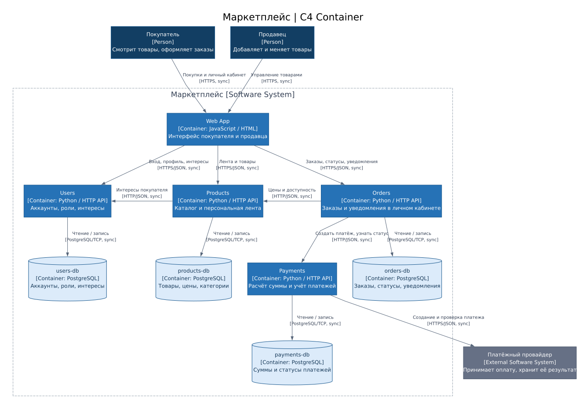

# Архитектура маркетплейса

Покупатель смотрит персональную ленту, оформляет и оплачивает заказы. Продавец управляет товарами. Уведомления о статусах заказов приходят в личный кабинет.

## 1. C4 Container



## 2. Запуск

Сервис Orders написан на Python 3.12 и реализует `GET /health`.

Из корня проекта:

```bash
docker build -t marketplace-orders .
docker run -d --rm --name marketplace-orders -p 127.0.0.1:8080:8080 marketplace-orders
docker ps --filter name=marketplace-orders
```

После появления статуса `healthy`:

```bash
curl -i http://127.0.0.1:8080/health
```

Ответ: `200 OK`, тело `{"status":"ok"}`.

## 3. Домены

| Домен | Ответственность |
| --- | --- |
| Пользователи | Аккаунты покупателей и продавцов, вход, роли и интересы |
| Каталог | Товары, цены, категории и доступность для покупки |
| Лента | Порядок товаров с учётом интересов покупателя |
| Заказы | Состав заказа, цены на момент покупки и статус |
| Платежи | Расчёт суммы к оплате, создание платежа и учёт результата |
| Уведомления | Сообщения о смене статуса заказа в личном кабинете |

Покупатель выбирает интересующие категории в профиле. Товары этих категорий идут первыми, внутри группы новые товары выше. Если интересов нет, лента сортируется по времени публикации.

## 4. Сервисы и владение данными

| Сервис | Домены | Собственные данные | Причина разбиения |
| --- | --- | --- | --- |
| Users | Пользователи | users-db: аккаунты, хеши паролей, роли, интересы | Один владелец аккаунтов и настроек |
| Products | Каталог, лента | products-db: товары, ID продавцов, цены, категории, доступность, дата публикации | Лента строится по данным каталога |
| Orders | Заказы, уведомления | orders-db: заказы, ID покупателей, состав, сохранённые цены, сумма, статусы, сообщения и отметки о прочтении | Уведомление создаётся при смене статуса заказа |
| Payments | Платежи | payments-db: ID заказов, суммы, валюта, статусы платежей, ID операций провайдера | Отдельный учёт оплаты и работа с платёжным провайдером |

У каждого сервиса отдельная база PostgreSQL. Общих баз нет, чужие данные доступны только через API. Web App собственной базы не имеет.

Orders хранит снимок названий и цен товаров, поэтому изменение каталога не меняет старые заказы. Payments хранит сумму платежа для учёта оплаты. Банковские карты обрабатывает провайдер.

## 5. Взаимодействия

Все вызовы **синхронные**.

| Кто вызывает | Кого | Зачем | Протокол |
| --- | --- | --- | --- |
| Покупатель и продавец | Web App | Работа с сайтом | HTTPS |
| Web App | Users | Вход, профиль, выбор интересов | HTTPS/JSON |
| Web App | Products | Лента, просмотр и изменение товаров | HTTPS/JSON |
| Web App | Orders | Заказы, статусы, уведомления и отметки о прочтении | HTTPS/JSON |
| Products | Users | Интересы покупателя | HTTP/JSON |
| Orders | Products | Цены и доступность товаров | HTTP/JSON |
| Orders | Payments | Создание платежа и проверка статуса | HTTP/JSON |
| Payments | Платёжный провайдер | Создание платежа, ссылка на оплату и результат | HTTPS/JSON |
| Каждый сервис | Своя база | Чтение и запись | PostgreSQL/TCP |

При оформлении Orders получает цены из Products и сохраняет заказ. Payments рассчитывает сумму по сохранённым ценам и количеству, создаёт платёж у провайдера и возвращает ссылку через Orders. Покупатель оплачивает по этой ссылке. Расчёт ведётся в рублях, без скидок и доставки.

При запросе статуса заказа Orders проверяет оплату через Payments. При смене статуса Orders сохраняет уведомление. Web App запрашивает уведомления при открытии личного кабинета и периодически обновляет список.

Без запроса к API статус сам не обновляется. Если Payments или провайдер недоступны, сохраняется последний известный статус.

## 6. Варианты архитектуры

### A. Модульный монолит

Все шесть доменов находятся в одном приложении с одной базой, код разделён на модули.

- Плюсы: простой запуск и тестирование, нет сетевых вызовов между модулями, связанные данные можно менять одной транзакцией.
- Минусы: всё приложение выпускается и масштабируется целиком, сбой процесса затрагивает все домены.
- Компромисс: простое сопровождение в обмен на общий выпуск и масштабирование.

### B. Четыре сервиса

Users, Products, Orders и Payments запускаются отдельно, имеют свои базы и общаются через HTTP API.

- Плюсы: понятные владельцы данных, независимый выпуск при сохранении API, отдельное масштабирование каталога.
- Минусы: четыре приложения и четыре базы, сетевые задержки и сбои, необходимость сохранять совместимость API. Общей транзакции на заказ и платёж нет.
- Компромисс: независимость сервисов в обмен на более сложное сопровождение и зависимость от сети.

## 7. Финальный выбор

Выбран **вариант B**. Пользователи, товары и платежи имеют разные задачи и данные. Каталог можно масштабировать под чтение ленты отдельно от заказов, а изменения в работе с провайдером сосредоточены в Payments.

Лента остаётся в Products, поскольку использует каталог. Уведомления остаются в Orders, поскольку связаны со статусами заказов. Это сокращает число сервисов и вызовов, но связывает выпуск ленты с каталогом, а уведомлений с заказами.

Прямые HTTP-вызовы позволяют обойтись без дополнительной инфраструктуры. Цена этого решения: вызывающий сервис зависит от доступности и времени ответа другого сервиса.
